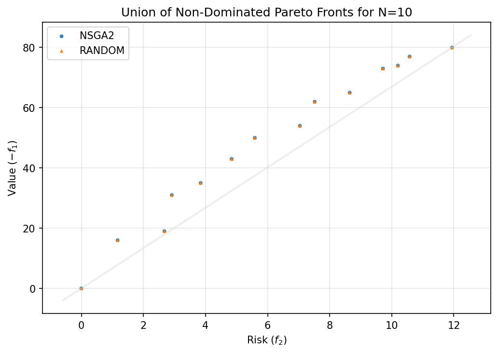
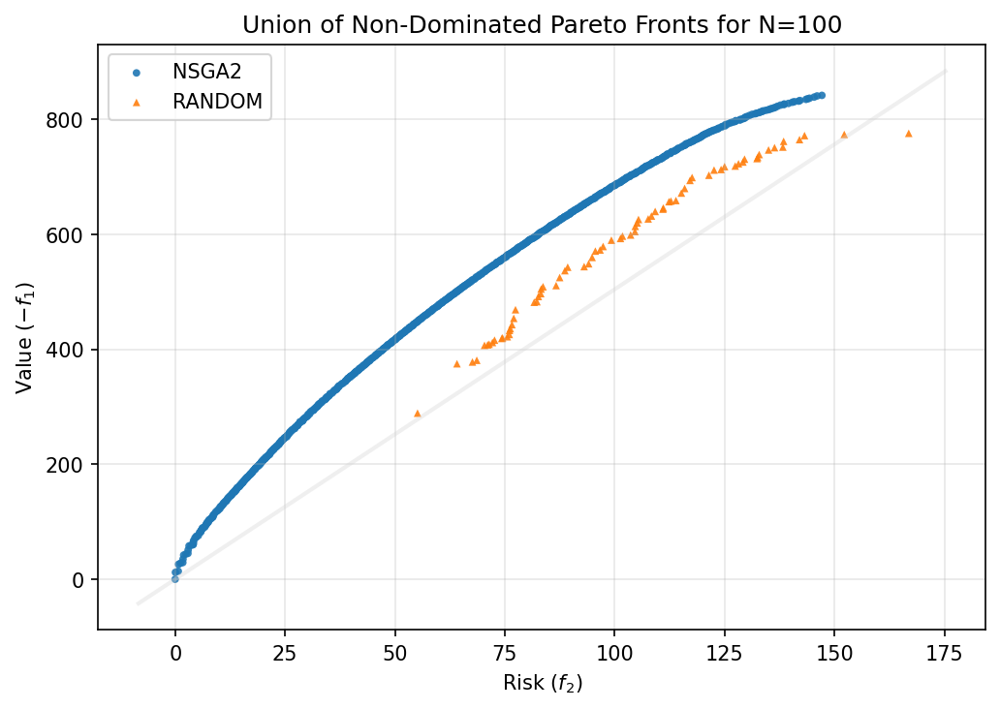
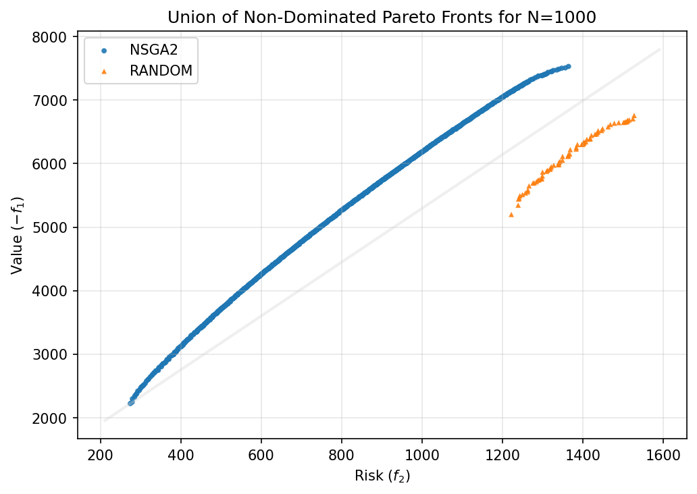
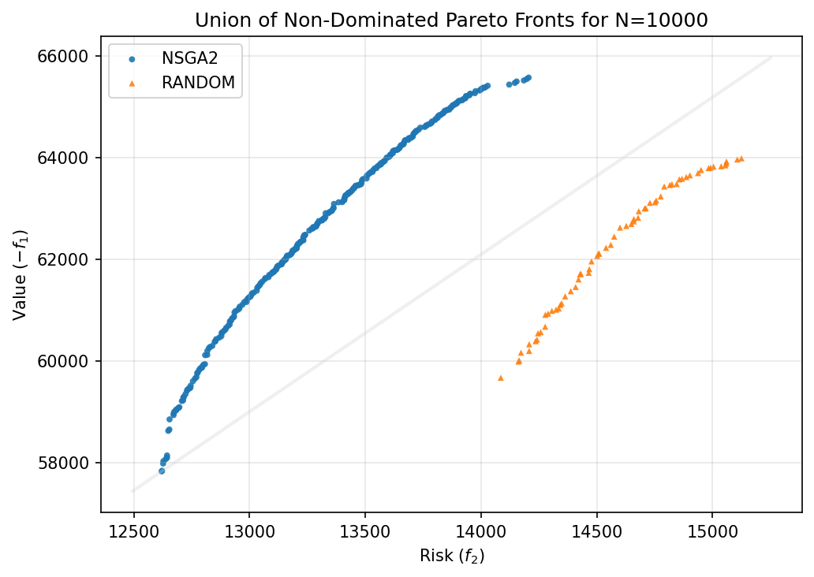
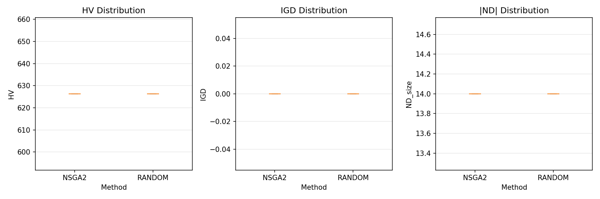
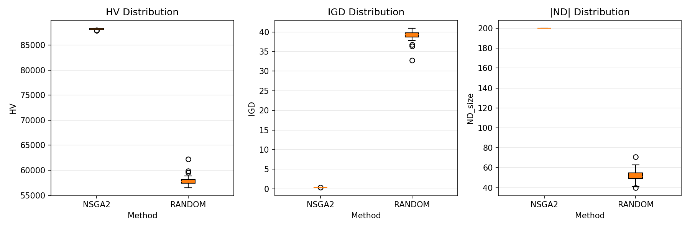
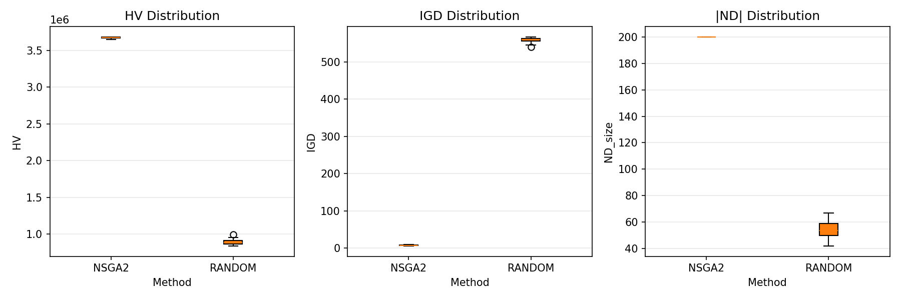
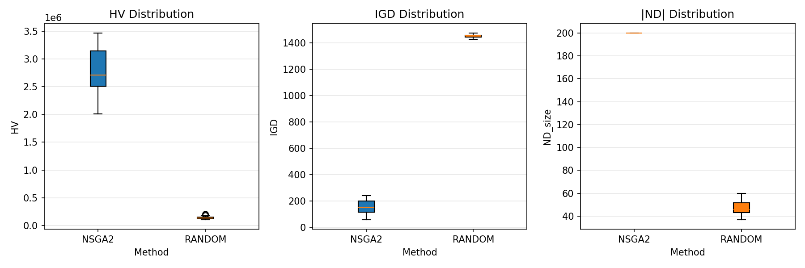

# Multi-Objective Knapsack-like Portfolio Optimization using Evolutionary Algorithms
**Authors:** Nikolay Penchev and Angel Marchev Jr.

## Introduction to the Problem
In finance, portfolio optimization aims to balance risk and return. For large portfolios with many assets, traditional methods (e.g., exhaustive search) become computationally expensive.
This report presents an experimental comparison of algorithms for a multi-objective knapsack-like portfolio optimization problem. The goal is to select a portfolio of assets that simultaneously maximizes the expected 'Value' (return) and minimizes the associated 'Risk'. These two objectives are often in conflict, requiring a trade-off. Multi-objective optimization is well-suited for this problem as it does not require a single, arbitrary weighting of risk versus return, but instead identifies a set of optimal trade-off solutions, known as the Pareto front.

## What is the Knapsack Problem?
A classic combinatorial optimization problem
- You have a knapsack with a capacity W.
- There are N items, each with value and weight
- The Goal is to Maximize total value without exceeding the knapsack capacity. 

In a portfolio context:

- Capacity -> budget/limit

- Item -> asset (e.g., stock, bond, etc.)

- Item(Weight) -> investment cost

- Item(Value) -> expected return

- Item(Risk) -> Volatility/Uncertainty

## Evolutionary Algorithms (EA)
- Key Idea: Inspired by natural selection.
- Main Steps:
  - Initialization of a population (random solutions).
  - Evaluation (Fitness) of each solution.
  - Selection of the best solutions.
  - Recombination (Crossover) and Mutation to create new solutions.
  - Repeat until stopping criteria are met.

## Algorithms

Two algorithms were compared in this study:

- **NSGA-II (Non-dominated Sorting Genetic Algorithm II):** A widely-used evolutionary algorithm for multi-objective optimization. It employs mechanisms of selection, crossover, and mutation to iteratively evolve a population of solutions toward the true Pareto front. Its key features include a fast non-dominated sorting procedure and a crowding distance mechanism to maintain diversity among solutions.

- **Random Search:** This method serves as a baseline for comparison. It generates solutions randomly within the search space for a fixed time budget equivalent to that of NSGA-II. This helps to assess whether the sophisticated mechanisms of NSGA-II provide a significant advantage over simple, undirected search.

## Data Description

We generate asset data using the np.random.normal function from the NumPy library. For each asset, three prop-
erties were generated: investment cost (weight), return, and
risk. The weights were drawn from a normal distribution
with a mean of 10 and a standard deviation of 3 using
np.random.normal (10, 3, 100,000). Returns were generated using np.random.normal(13, 3, 10000), and risks were
generated similarly with a specified mean and standard
deviation. Using np.random.normal provides several advantages:
Realistic Data Distribution: The normal distribution models
real-world financial data well, reflecting the variability and
uncertainty of asset returns and risks.
Controlled Variability: The mean and standard deviation
allow for precise control over the data set’s characteristics.
Scalability: NumPy supports efficient generation of large
datasets with minimal computational cost.
Reproducibility: By setting a random seed, the same
data can be regenerated, ensuring the reproducibility of the
results. In general, the use of np.random.normal for data
generation in this study allows the creation of realistic,
scalable, and reproducible datasets, providing a solid foundation for evaluating the performance of portfolio optimization
algorithms.

## 1. Setup

This report summarizes the performance of multi-objective optimization methods.

- **Problem Sizes (N):** ['10', '100', '1000', '10000']
- **Methods:** ['NSGA2', 'RANDOM']
- **Seeds:** [0, 1, 2, 3, 4, 5, 6, 7, 8, 9, 10, 11, 12, 13, 14, 15, 16, 17, 18, 19, 20, 21, 22, 23, 24, 25, 26, 27, 28, 29]
- **Total Runs:** 240
- **Time Caps (s):** [25, 100, 175, 250]

**Objective Interpretation:**
- **Value(Expected return):** `-f1` (higher is better)
- **Risk:** `f2` (lower is better)

The goal is to find solutions that maximize the Expected return while minimizing Risk, representing a classic Pareto trade-off.

## 2. Performance Metrics

Metrics are aggregated across seeds (mean ± 95% CI).

- **HV (Hypervolume) ↑:** Measures the volume of the dominated portion of the objective space. Higher is better.
- **IGD+ (Inverted Generational Distance Plus) ↓:** Measures the average distance from each point in the reference front to the obtained front. Lower is better.
- **|ND| (Number of Non-Dominated Points) ↑:** The number of points in the final Pareto front. Higher is generally better, indicating more choices.
- **Pareto Fronts:** The set of non-dominated solutions found by each algorithm.

### HV (↑) mean ± 95% CI

| N | NSGA2 | RANDOM |
|---|---|---|
| 10 | 626.327 (626.327 - 626.327) | 626.327 (626.327 - 626.327) |
| 100 | 88210.700 (88169.537 - 88251.864) | 57972.241 (57579.739 - 58364.743) |
| 1000 | 3672542.847 (3669368.677 - 3675717.017) | 892217.123 (879423.465 - 905010.781) |
| 10000 | 2779940.308 (2629782.103 - 2930098.513) | 137958.226 (128440.809 - 147475.642) |

### IGD+ (↓) mean ± 95% CI

| N | NSGA2 | RANDOM |
|---|---|---|
| 10 | 0.000 (0.000 - 0.000) | 0.000 (0.000 - 0.000) |
| 100 | 0.327 (0.319 - 0.335) | 39.023 (38.445 - 39.600) |
| 1000 | 7.114 (6.791 - 7.438) | 558.306 (555.985 - 560.627) |
| 10000 | 149.190 (129.544 - 168.835) | 1453.729 (1449.668 - 1457.789) |

### |ND| (↑) mean ± 95% CI

| N | NSGA2 | RANDOM |
|---|---|---|
| 10 | 14 (14 - 14) | 14 (14 - 14) |
| 100 | 200 (200 - 200) | 52 (50 - 55) |
| 1000 | 200 (200 - 200) | 54 (52 - 57) |
| 10000 | 200 (200 - 200) | 47 (45 - 49) |

## 3. Pareto Fronts

Scatter plots of **Risk vs. Value**.  
The ideal region is the top-left (low risk, high value).  
NSGA-II is expected to produce fronts that dominate the random search, demonstrating its effectiveness.

### N = 10

### N = 100

### N = 1000

### N = 10000

## 4. Combined Boxplots (HV / IGD / |ND|)

### N = 10

### N = 100

### N = 1000

### N = 10000

## 5. Runtime Overview

